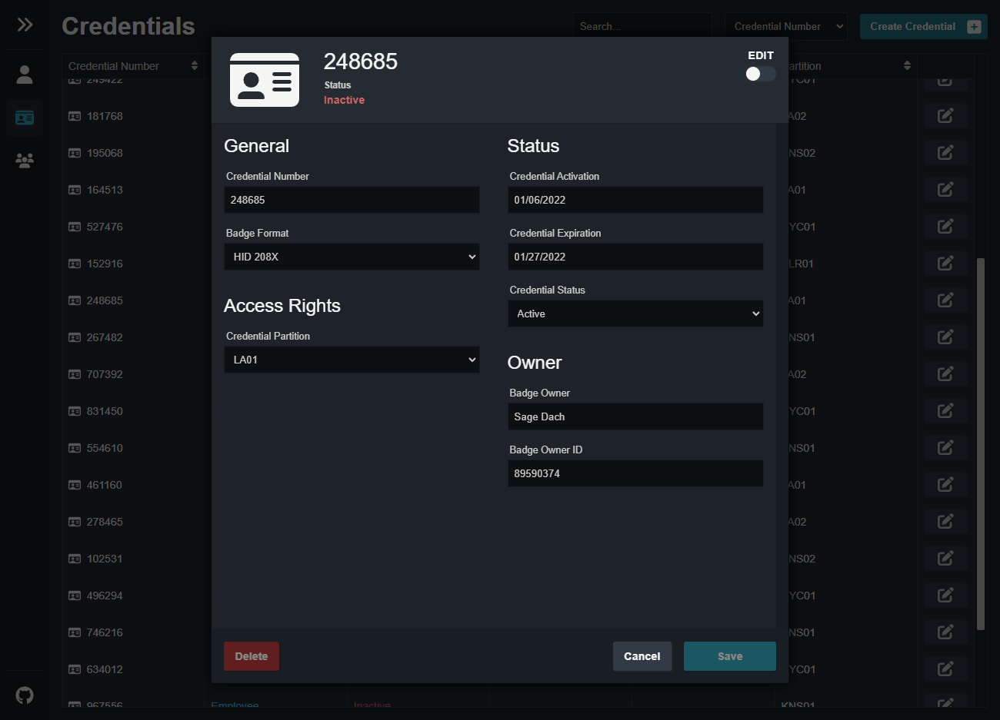

# Security Badging System

An application used to display and edit cardholder data meant for a security badging system. Built with React and Sass.

## Notable features

- Full CRUD functionality through Express/MongoDB REST backend
  - [(Repository here)](https://github.com/kuanoni/security-badging-system-api)
- Easily read data using React Table
- Virtualized infinite scrolling implemented using React Query & React Virtual
- UI implemented using React & Sass
- Internal Routing via React Router

## Live Demo

[https://security-badging-system.web.app/](https://security-badging-system.web.app/)

## Screen Shot(s)

## Installation and Setup Instructions

Clone down this repository. You will need `node` and `npm` installed globally on your machine.

Installation:

`npm install`

To Start Server:

`npm start`

To Visit App:

`localhost:3000/`
